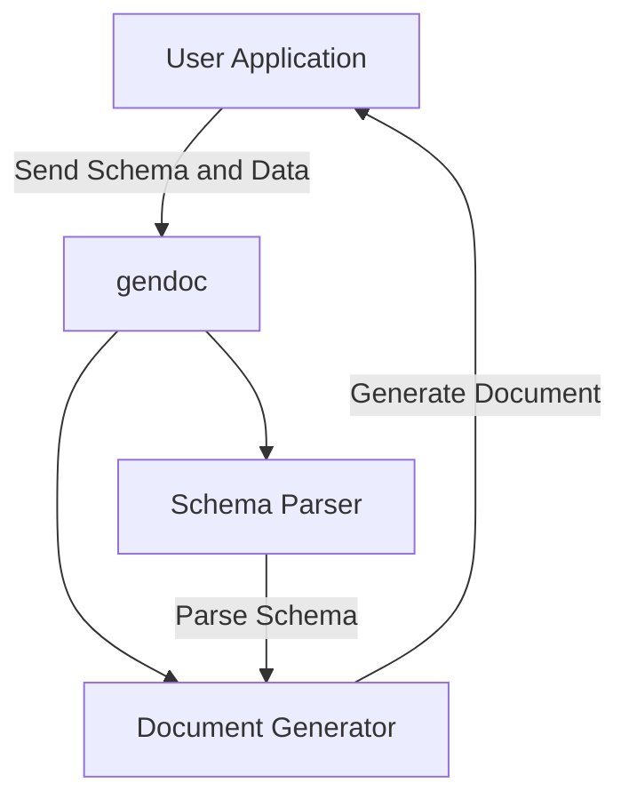

# gendoc

## Overview

The Document Generator (gendoc) is a flexible and powerful Express.js TypeScript application designed to generate documents based on user-provided schemas. By allowing users to define their own document structure, fields, and clauses, gendoc provides a versatile solution for creating customized legal documents, contracts, reports, and more.

### Key Features

- **User-Defined Schemas:** Create custom schemas that define the structure of your documents, including sections, fields, and clauses.
- **Dynamic Document Generation:** Generate documents dynamically based on the provided schema and user input.
- **Flexible Clause Construction:** Use constructors to determine how different sections of the document are generated, supporting complex conditional logic and dynamic content.
- **Scalability:** Easily scale the application to handle different types of documents and expand the library of available constructors.

## Setup Guide

### Prerequisites

- **Node.js 16 or higher**
- **npm 7 or higher**
- **TypeScript 4.0 or higher**
- **MongoDB** (optional for schema storage)

### Installation

1. **Clone the repository:**

    ```bash
    git clone https://github.com/lucasodra/gendoc.git
    cd gendoc
    ```

2. **Install dependencies:**

    ```bash
    npm install
    ```

3. **Configure the application:**

   Modify the `config/default.json` file to set up your MongoDB connection (if used) and other configuration settings.

4. **Build the project:**

    ```bash
    npm run build
    ```

5. **Run the application:**

    ```bash
    npm start
    ```

6. **Access the application:**

   The application will be available at `http://localhost:3000`.

## Docker Setup

To run the gendoc app using Docker, follow these steps:

### Prerequisites

- Ensure that Docker is installed on your machine. You can download it from [Docker's official website](https://www.docker.com/products/docker-desktop).

### Steps to Build and Run the Docker Container

1. **Clone the Repository**

   If you haven't already, clone the repository to your local machine:

   ```bash
   git clone https://github.com/lucasodra/gendoc.git
   cd gendoc
   ```

2. **Build the Docker Image**

   Use the following command to build the Docker image for the gendoc app:

   ```bash
   docker build -t gendoc-app .
   ```

   This command will create a Docker image named `gendoc-app` using the `Dockerfile` present in the repository.

3. **Run the Docker Container**

   Once the Docker image is built, you can run the application in a Docker container using the following command:

   ```bash
   docker run -d -p 3000:3000 --name gendoc-container gendoc-app
   ```

   This command will:
   - Run the container in detached mode (`-d`).
   - Map port 3000 on your host machine to port 3000 in the container (`-p 3000:3000`).
   - Name the running container `gendoc-container` (`--name gendoc-container`).

4. **Access the Application**

   After the container is running, you can access the gendoc application by navigating to:

   ```
   http://localhost:3000
   ```

5. **Stopping the Container**

   To stop the container, use the following command:

   ```bash
   docker stop gendoc-container
   ```

6. **Removing the Container**

   If you want to remove the container after stopping it, run:

   ```bash
   docker rm gendoc-container
   ```

7. **Cleaning Up Docker Resources**

   Optionally, you can remove the Docker image if you no longer need it:

   ```bash
   docker rmi gendoc-app
   ```

## High-Level Architecture



## Core Components

1. **Schema Parser:**
   - Parses the user-provided schema to validate its structure and ensure it aligns with the required document format.
   - Supports dynamic and conditional field inclusion based on the schema definition.

2. **Document Generator:**
   - Uses the parsed schema and user input to generate documents, filling in templates with the appropriate data.
   - Supports various document formats such as PDF, DOCX, and plain text.

3. **Clause Constructors:**
   - Modular constructors that define how specific sections of a document should be generated based on the input.
   - Allows complex logic for including or excluding sections and dynamically generating content based on the schema.

### Database (Optional)

- **MongoDB:**
  - Stores user-defined schemas and generated documents for easy retrieval and management.

### Security

- **Data in Transit:** Uses HTTPS for secure data transmission.
- **Access Control:** Implement OAuth2 or JWT for securing the API endpoints.
- **Document Storage:** If storing documents in MongoDB, ensure data encryption at rest.

## Usage

### Defining a Schema

Users define schemas that describe the structure of their documents. For example, a schema for a will might include sections for "Introduction", "Executors", and "Assets", with fields like "Name", "Identification Number", and "Address".

**Example Schema:**

```json
{
    "title": "Last Will and Testament",
    "sections": [
        {
            "order": 1,
            "name": "Introduction",
            "fields": {
                "fullName": "string",
                "identificationNo": "string",
                "address": "string"
            },
            "clauses": [
                "I, [fullName], bearing NRIC [identificationNo], residing at [address], hereby declare this to be my last will and testament."
            ]
        },
        {
            "order": 2,
            "name": "Executors",
            "fields": {
                "executors": {
                    "type": "array",
                    "items": {
                        "name": "string",
                        "identificationNo": "string",
                        "address": "string"
                    }
                }
            },
            "clauses": [
                "I appoint [executors[0].name] of [executors[0].address] as the executor of my will."
            ]
        }
    ]
}
```

### Generating a Document

Once a schema is defined and data is provided, the application uses this information to generate a document.

**Example API Request:**

```json
{
    "schemaId": "60f6c75b4f1c2a4b3e7a83b2",
    "data": {
        "fullName": "John Doe",
        "identificationNo": "S1234567A",
        "address": "123 Main St",
        "executors": [
            {
                "name": "Jane Doe",
                "identificationNo": "S2345678B",
                "address": "456 Elm St"
            }
        ]
    }
}
```

**Example Response:**

```json
{
    "documentUrl": "https://gendoc.lucasodra.com/documents/60f6c75b4f1c2a4b3e7a83b2.pdf"
}
```

## Contribution

We welcome contributions to enhance the capabilities of gendoc! Please follow these steps:

1. **Fork the repository.**
2. **Create a feature branch:** `git checkout -b feature/YourFeature`
3. **Commit your changes:** `git commit -m 'Add YourFeature'`
4. **Push to the branch:** `git push origin feature/YourFeature`
5. **Open a Pull Request.**

Please ensure that your code adheres to the coding standards and includes appropriate tests.

## License

This project is licensed under the MIT License - see the [LICENSE](LICENSE) file for details.